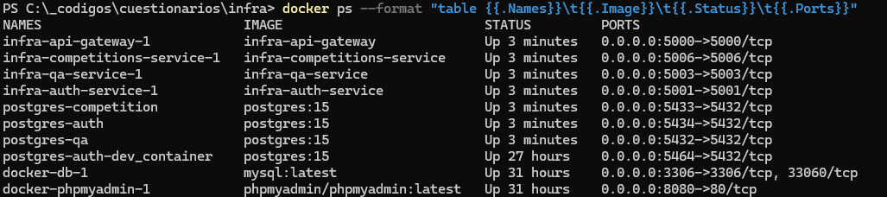
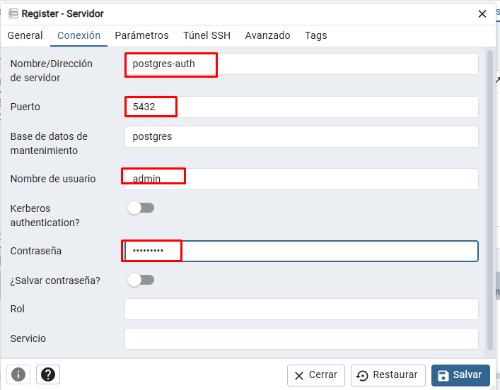

# 📦 Repositorio de Infraestructura (Infra)

Este repositorio contiene la configuración de la infraestructura utilizando Docker Compose para orquestar los servicios necesarios de la aplicación.

## 📁 Contenido del Repositorio

- **compose/**: Archivo `docker-compose.yml` para levantar los servicios de la aplicación.
- **.env**: Archivo de configuración de variables de entorno.
- **README.md**: Documentación del repositorio.

---

## ✅ Requisitos Previos

Asegúrate de tener instaladas las siguientes herramientas en tu sistema:

- 🐳 [Docker](https://www.docker.com/) (version 20.x o superior)
- 📜 [Docker Compose](https://docs.docker.com/compose/) (version 1.29 o superior)
- 🌐 Git

---

## 🚀 Primeros pasos rápidos

```bash
git clone https://github.com/cuestionarios-org/infra.git
cd infra
bash scripts/init.sh
```

Este comando inicializa todo el entorno: clona o actualiza automáticamente los repositorios necesarios y verifica que Docker y Docker Compose estén disponibles. **No necesitas instalar dependencias manualmente en cada servicio, ya que Docker se encarga de todo.**

> **Nota para usuarios de Windows:**  
> Se recomienda ejecutar los scripts `.sh` usando [Git Bash](https://gitforwindows.org/) o [WSL](https://learn.microsoft.com/es-es/windows/wsl/) para evitar problemas de compatibilidad.

---

## ⚙️ Configuración

1. **Variables de entorno**

   - El archivo `.Template_env` se copiará y renombrará como `.env`.
   - Estas variables son esenciales para los puertos y servidores de todos los servicios.

2. **Estructura de Directorios**

   Al ejecutar el script de inicialización, los servicios `gateway-api`, `auth-service`, etc., se clonan automáticamente en directorios adyacentes a la carpeta de infraestructura:

   ```
   /infra
   /gateway-api
   /auth-service
   /competition-service
   /qa-service
   ```

---

## 📝 Notas adicionales

- Si necesitas limpiar el entorno, puedes usar:  
  ```bash
  bash scripts/clean.sh
  ```
- Para detener los servicios:  
  ```bash
  docker-compose down
  ```
- Si tienes problemas de permisos con los scripts, ejecuta:  
  ```bash
  chmod +x scripts/*.sh
  ```


---

# 🚀 Uso
**Nota:** Ojo con los archivos .sh, desde vscode cambiar el CRLf a LF (abajo a la derecha)
(TODO_26/3/25: Hacer en auto)

# 1. Construir y Levantar los Servicios
   Este repo como solo es de infraestructura no hay nada que instalar, solo debemos estar en el directorio donde esta el `docker-compose.yml` y desde alli:
   - Ejecuta el siguiente comando para construir y levantar los servicios:

   ```bash
   docker-compose up --build
   ```

   Esto iniciará los servicios.

# 2. Verificar Servicios Activos

   Puedes verificar los servicios activos utilizando el siguiente comando:

   ```bash
   docker ps
   ```
   o un listado mas elegante:
   ```bash
   docker ps --format "table {{.Names}}\t{{.Image}}\t{{.Status}}\t{{.Ports}}"
   ```
   


# 3. Acceso a los Servicios

   - 🌐 **API Gateway:** Disponible en [http://localhost:5000](http://localhost:5000)
   - 🔒 **Auth Service:** Disponible en [http://localhost:5001](http://localhost:5001)
   - **QA Service:** Disponible en [http://localhost:5003](http://localhost:5003)
   - **Competition Service:** Disponible en [http://localhost:5006](http://localhost:5006)

# 4. Prueba ENDPOINT
   Verificar endopints basicos con curl
- ## Home
   ```bash
   curl -X GET http://localhost:5000
   ```  
   Deberia responder con unos datos simples para chequeo de que funciona
- ## AUTH **/auth**
   
   - Register
   ```bash
   curl -X POST http://localhost:5000/auth/register \
   -H "Content-Type: application/json" \
   -d '{"username":"test01", "email": "test01@test.com", "password": "1234"}'
   ```
   - Login, como admin
   ```bash
   curl -X POST http://localhost:5000/auth/login \
   -H "Content-Type: application/json" \
   -d '{"email": "admin@example.com", "password": "admin123"}'
   ```
   Deberia retornar un token. Con ese token podemos listar los usuarios:
   - Listado de usuarios ruta protegida, token y user admin
   ```bash
   curl -X GET http://localhost:5000/auth/list \
   -H "Authorization: Bearer YOUR_TOKEN_HERE"
   ```   

   El resultado deberia ser un listado de usuarios.
   
- ## Preguntas **/questions**

   - Listado de categorias para las preguntas
   ```bash
   curl -X GET http://localhost:5000/questions/categories/
   ``` 
   - Agregar categoria para las preguntas (El name debe ser unico)
   ```bash
   curl -X POST http://localhost:5000/questions/categories/\
   -H "Authorization: Bearer YOUR_TOKEN_HERE" \
   -d '{"description": "Noticias y eventos deportivos",
    "name": "Deportes"}'
   ``` 
   - Listado de preguntas
   ```bash
   curl -X GET http://localhost:5000/questions/
   ```
   - Listado de preguntas por categorias
   ```bash
   curl -X GET http://localhost:5000/questions/1 \
   -H "Authorization: Bearer YOUR_TOKEN_HERE"
   ```

   - Obtener una pregunta
   ```bash
   curl -X GET http://localhost:5000/questions/1 \
   -H "Authorization: Bearer YOUR_TOKEN_HERE"
   ```
   - Agregar una pregunta
      - La pregunta ya se agrega con sus respuestas
      - Las respuestas pueden ser existentes o nuevas, normalmente son nuevas.
      - Datos minimos del body para crear una pregunta con sus respuestas:
      ```json
      {"answers": [
      {
         "is_correct": false,
         "text": "Un tipo de software"
      },
      {
         "is_correct": true,
         "text": "Una simulación de procesos humanos por máquinas"
      },
      {
         "is_correct": false,
         "text": "Un lenguaje de programación"
      }],"question": {
      "category_id": 1,
      "text": "¿Qué !!!es la inteligencia artificial?" }}
   

   - Modifica una pregunta
      - La pregunta se modifica y elimina las respuestas anteriores generando las nuevas.
      - Datos minimos del body para crear una pregunta con sus respuestas:
      ```json
      {"answers": [
      {
         "is_correct": false,
         "text": "Un tipo de software"
      },
      {
         "is_correct": true,
         "text": "Una simulación de procesos humanos por máquinas"
      },
      {
         "is_correct": false,
         "text": "Un lenguaje de programación"
      }],"question": {
      "text": "¿Qué es la inteligencia artificial?" }}
   

- ## Cuestionarios   **/quizzes**
   - Listado de cuestionarios
   ```bash
   curl -X GET http://localhost:5000/quizzes \
   -H "Authorization: Bearer YOUR_TOKEN_HERE"
   ```
   - Obtener un cuestionario por id
   ```bash
   curl -X GET http://localhost:5000/quizzes/id \
   -H "Authorization: Bearer YOUR_TOKEN_HERE"
   ```
   - Agregar un Cuestionario
      - El cuestionario se agrega minimamente con title y category_id
      - Datos minimos del body para crear un cuestionario:
      ```json
      {
         "quiz":{
            "title": "Primer Cuestionario",
            "category_id": 1
         }         
      }
      - Lo mas sano seria crearlo ya con preguntas asociadas, los ids deben ser pregutas que ya existan en el sistema, sino dara falla:
      ```json
      {
         "quiz":{
            "title": "Primer Cuestionario",
            "category_id": 1
         },
         "question_ids": [1,5,6,7] 
      }
   - Modificar un Cuestionario
      - Se envia en el body los datos del quiz que se deseen modificar.
      - NO MODIFICA PREGUNTAS
       ```json
      {
         "quiz":{
            "title": "Primer Cuestionario",
            "category_id": 1
         }        
      }
- ## Competencias   **/competitions**
   - Listado de competencias
   ```bash
   curl -X GET http://localhost:5000/competitions
   ```
   - Obtener una competencia por id
   ```bash
   curl -X GET http://localhost:5000/competitions/id \
   -H "Authorization: Bearer YOUR_TOKEN_HERE"
   ```
   - Agregar una Competencia
      - Campos obligatorios: 'title', 'start_date', 'end_date', 'created_by' (viene por el token)
      - Datos minimos del body para crear una competencia:
      ```json
      {
         "title": "Primer Competencia",
         "start_date": "2025-04-11",
         "end_date": "2025-04-21",
      }   
      - Se puede ya en la creacion definir los cuestionarios de la competencia, luego se pueden ir agregando mas.  
      - Datos minimos de cada cuestionario es el quizz_id:    
      ```json
      {
         "title": "Primer Competencia con Cuestionarios",
         "start_date": "2025-04-11",
         "end_date": "2025-04-21",
         "quizzes": [
            {"quiz_id":1},
            {"quiz_id":3}
            ]
      }   
      - Datos aconsejables en la peticion
         - el time_limit 0 es sin tiempo, otro valor es en segundos para terminar el intento.
         - Los tiempos de inicio y final de cada quiz deben estar dentro de los de la competencia, sino error.
      ```json
      {
         "title": "Primer Competencia con Cuestionarios",
         "start_date": "2025-04-11T12:30:00",
         "end_date": "2025-04-21",
         "quizzes": [
            {
               "quiz_id":1,
               "start_time": "2025-04-11T14:00:00",  
               "end_time": "2025-04-13T14:00:00",  
               "time_limit": 300
            },
            {
               "quiz_id":4,
               "start_time": "2025-04-15T14:00:00",  
               "end_time": "2025-04-15T19:00:00",  
               "time_limit": 0
            }
            ]
      }   

   - Editar una competencia, ejemplo agregar cuestionario (puede ser una tarea habitual)
      - Lo mas simple es editar algo general de esta manera:
      ```json
      {
         "credit_cost": 2
      }
      - o el estado algo que internamente tambien se realiza automatco
      ```json
      {
         "state": "lista"
      }
      - Que sucede con los cuestionarios ?, estos se van a poder:
         - **agregar** estado de la competencia: 'preparacion', 'lista', 'en curso'
         - **modificar** estado de la competencia: 'preparacion'
         - **modificar** estado de la competencia: lista', 'en curso' y las fechas del cuestionario dentro de la competencia sean corectas **NO IMPLEMENTADO AUN**
         - **eliminar estado de la competencia: 'preparacion'
         - El "quiz_id" es obligatorio para referenciar al quiz que se modificara o agregara, y el "quiz_id" que estaba antes y ahora no este se elimina, si no debe eliminarse se debe pasar su "quiz_id" y nada para modificar.
         ```json
         {
         "quizzes": [
         {
         "quiz_id": 1,
         "end_time": "2025-04-19T11:25:17",
         "time_limit": 78
         },
         {
         "quiz_id": 31,
         "start_time": "2025-04-19T11:25:17",
         "end_time": null
         },
         {
         "quiz_id": 5
         }
      ]
      }
   
   - Inscripciones a una Competencia
   ```bash
   curl -X GET http://localhost:5000/competitions/id \
   -H "Authorization: Bearer YOUR_TOKEN_HERE"
   ```

---
5. PGAdmin

🔗 Acceder a pgAdmin
Abre tu navegador y ve a http://localhost:5050

Inicia sesión con:

Usuario: admin@example.com

Contraseña: admin1234

Agrega una conexión para cada base de datos.

🔧 Configurar conexiones en pgAdmin
Para agregar cada base de datos:

Ve a Servers → Add New Server

En la pestaña General:

Name: PostgreSQL (o cualquier nombre)

En la pestaña Connection:

Host:

postgres-auth (para la base auth)

postgres-qa (para qa)

postgres-competition (para competition)

Port:

5434 para auth

5432 para qa

5433 para competition

Username y Password: Usa los valores de tu .env

 

💡 Nota: Si accedes desde fuera de Docker (por ejemplo, con psql en tu PC), usa localhost en lugar del nombre del servicio.


---


## 📜 Scripts

Este repositorio incluye una carpeta `scripts/` con herramientas para automatizar tareas comunes. A continuación, se detallan los scripts disponibles y su uso:

1. **Inicializar Servicios:**

   Script: `scripts/init-services.sh`

   Uso:
   ```bash
   ./scripts/init-services.sh
   ```
   Este script construye y levanta todos los servicios definidos en `docker-compose.yml`.

2. **Limpiar Recursos:**

   Script: `scripts/clean-resources.sh`

   Uso:
   ```bash
   ./scripts/clean-resources.sh
   ```
   Este script detiene y elimina los contenedores, redes y volúmenes asociados a los servicios.

3. **Verificar Dependencias:**

   Script: `scripts/check-dependencies.sh`

   Uso:
   ```bash
   ./scripts/check-dependencies.sh
   ```
   Este script verifica que Docker, Docker Compose y Git estén instalados y configurados correctamente.

Para ejecutar los scripts, asegúrate de otorgar permisos de ejecución:

```bash
chmod +x ./scripts/*.sh
```

---

## 🛠️ Solución de Problemas

- **Error de Conexión entre Servicios:**
  Verifica que los servicios están configurados para usar el hostname correcto. En Docker Compose, utiliza el nombre del servicio (por ejemplo, `auth-service`) en lugar de `localhost`.

- **Puertos Ocupados:**
  Si los puertos `5000` o `5001` ya están en uso, puedes modificarlos en el archivo `docker-compose.yml`:

  ```yaml
  ports:
    - "nuevo-puerto:5000"  # Para api-gateway
    - "nuevo-puerto:5001"  # Para auth-service
  ```


---

## ⏹️ Apagar los Servicios

Para detener los servicios, utiliza el siguiente comando:

```bash
docker-compose down
```

Esto también eliminará los contenedores creados, pero conservará los volúmenes.

---

## 🤝 Contribuir

Si deseas contribuir al repositorio, abre un pull request o informa de un problema en el repositorio.

---

## 📜 Licencia

Este proyecto está licenciado bajo los términos de [MIT License](LICENSE).

Desarrollado con ❤️ por [Fernando Masino](https://github.com/fom78).